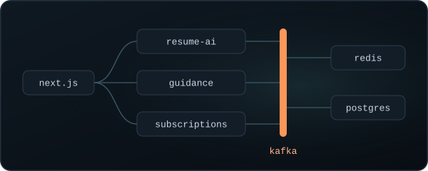
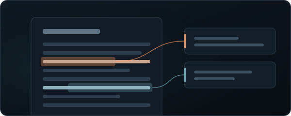

<!--
  Profile README for github.com/yats1304/yats1304
  Keep these four files in ./assets next to this README:
  profile-header.svg, project-hirenest.svg, project-pdf-highlight-hub.svg, footer-cta.svg
-->

  

  <a href="https://portfolio-bice-psi-56.vercel.app/"><strong>Portfolio</strong></a>
  &nbsp;&nbsp;/&nbsp;&nbsp;
  <a href="https://www.linkedin.com/in/yatish-chaubal-03331b206/"><strong>LinkedIn</strong></a>
  &nbsp;&nbsp;/&nbsp;&nbsp;
  <a href="mailto:chaubaly@gmail.com"><strong>Email</strong></a>

 

I'm a **Software Developer at Schach Engineers**, building backend APIs, full-stack applications, and internal business systems. I work mainly in **Go** with Gin, Encore, PostgreSQL, and GORM v2, paired with **React, Next.js, and TypeScript** on the frontend.

I take work from API design and database integration through performance tuning to production deployment.

## What I do

<table>
  <tr>
    <td width="33%" valign="top">
      <h3>APIs and business systems</h3>
      
REST APIs, authentication and authorization, business workflows, and external integrations.

    </td>
    <td width="33%" valign="top">
      <h3>Interface to deployment</h3>
      
React and Next.js applications, internal dashboards, and deployments with Docker, Linux, and Nginx.

    </td>
    <td width="33%" valign="top">
      <h3>Lighthouse 78 to 96</h3>
      
Raised the performance score of a production application by 18 points.

    </td>
  </tr>
</table>

## Selected projects

<table>
  <tr>
    <td width="50%" valign="top">
      
      <h3>HireNest</h3>
      
<strong>AI-powered job platform</strong>

      
A microservices-based platform combining AI resume analysis, career guidance, and Razorpay subscriptions.

      
<strong>Engineering focus:</strong> Redis caching, Kafka-based services, and Dockerized deployment on AWS EC2.

      
<code>Next.js</code> <code>Node.js</code> <code>PostgreSQL</code> <code>Redis</code> <code>Kafka</code> <code>Docker</code> <code>AWS EC2</code>

      <!-- Add a verified HireNest source or demo link here when available. -->
    </td>
    <td width="50%" valign="top">
      
      <h3>PDF Highlight Hub</h3>
      
<strong>PDF annotation platform</strong>

      
A full-stack application for highlighting, annotating, and managing PDF content.

      
<strong>Engineering focus:</strong> A Next.js and TypeScript interface, a Node.js backend, MongoDB, and JWT authentication.

      
<code>Next.js</code> <code>TypeScript</code> <code>Node.js</code> <code>MongoDB</code> <code>JWT</code>

      
<a href="https://pdf-highlight-hub.vercel.app/"><strong>Live demo</strong></a> &nbsp;/&nbsp; <a href="https://github.com/yats1304/Pdf_HighlightHub"><strong>Source code</strong></a>

    </td>
  </tr>
</table>

<strong>Four more projects</strong>

 

| Project | What it does | Built with | Links |
| :--- | :--- | :--- | :--- |
| **Tasty Treat Cafe** | Restaurant menu browsing and location support. | React, Material UI, Google Maps API | [Live demo](https://tasty-treat-cafe.vercel.app/) / [Source](https://github.com/yats1304/tasty_treat_cafe) |
| **Klimate** | Weather forecasts, city search, and saved locations. | React, TypeScript, OpenWeatherMap API | [Source](https://github.com/yats1304/klimate) |
| **Movie Browser** | Movie discovery and search using live TMDB data. | React, TMDB API | [Source](https://github.com/yats1304/movie-browser-tmdb) |
| **AI Chatbot** | Real-time conversations powered by Gemini. | React, Gemini API | [Source](https://github.com/yats1304/Chatbot_React) |

## Toolkit

| Area | Technologies |
| :--- | :--- |
| **Core backend** | **Go, Gin, Encore, GORM v2, REST APIs** |
| **Frontend** | React, Next.js, TypeScript, Redux, Tailwind CSS, Material UI |
| **Data and messaging** | PostgreSQL, Redis, MongoDB, MySQL, Kafka |
| **Additional backend** | Node.js, Express.js, FastAPI |
| **Deployment and tools** | Docker, AWS EC2, Nginx, Linux, Git, GitHub, Vercel, Render |

## What I'm studying now

Advanced Go, system design, PostgreSQL optimization, GORM v2 patterns, event-driven architecture, and observability, with an emphasis on maintainable services and production reliability.

 

  

  
    <a href="mailto:chaubaly@gmail.com">chaubaly@gmail.com</a>
    &nbsp;/&nbsp;
    <a href="https://www.linkedin.com/in/yatish-chaubal-03331b206/">LinkedIn</a>
    &nbsp;/&nbsp;
    <a href="https://portfolio-bice-psi-56.vercel.app/">Portfolio</a>
    &nbsp;/&nbsp;
    <a href="https://github.com/yats1304">GitHub</a>
    &nbsp;/&nbsp;
    <a href="https://x.com/Yatish17948398">X</a>
  

